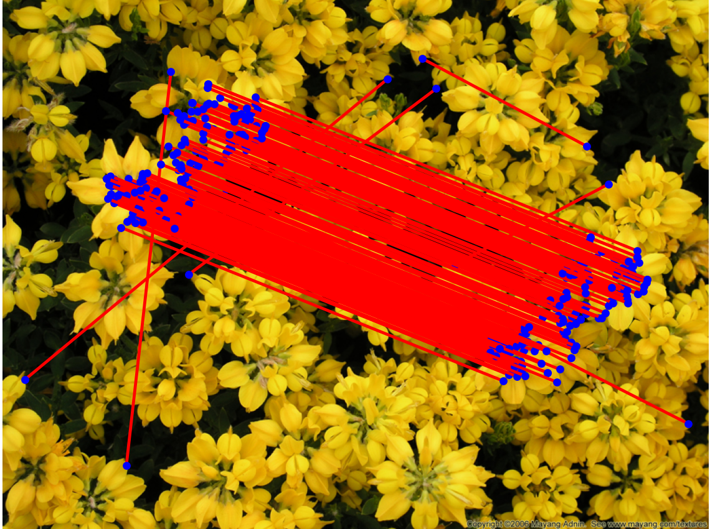
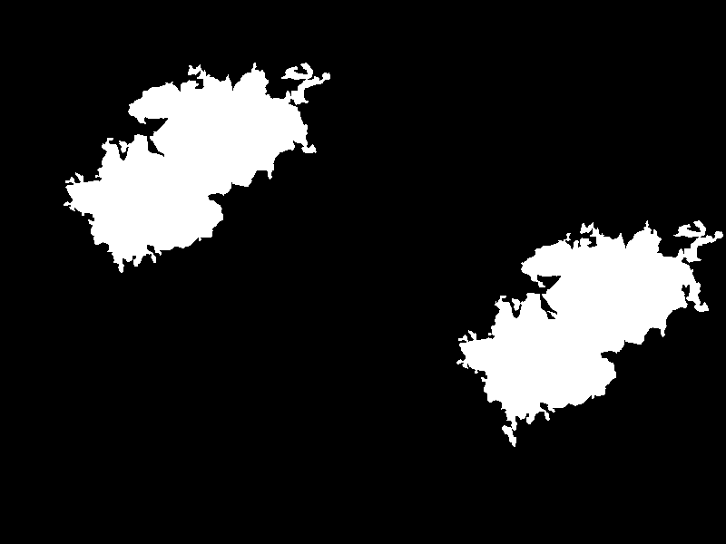
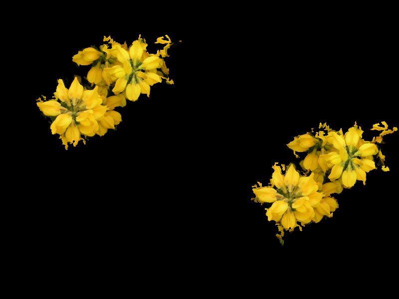

# SIFT-based-copy-move-forgery-detection
SIFT based copy move forgery detection and localisation

## Copy-move detection

Detect copy-move into an image:
~~~
import cv2
from detection import copy_move_detector

im = cv2.imread("assets/fiori-gialli.jpg")
score = copy_move_detector(im)
print(score[0])
~~~

## Copy-move localisation

Localize copy-move into an image:
~~~
import cv2
import matplotlib.pyplot as plt
import numpy as np
from localisation import copy_move_localisation

image = cv2.imread('./assets/fiori-gialli.jpg')
mask, score, _ = copy_move_localisation(image)
bin_mask = 255 * (np.uint8(mask > 0))
plt.imshow(bin_mask, cmap='Greys')
plt.show()
~~~

`

## Parameter configuration

To tweak algorithm parameters edit the values in _configuration.py_.

## Docker

Build:
~~~
docker build -t copy-move-detector .
~~~

Run (assuming test images are in $(pwd)/test directory):
~~~
docker run -v "$(pwd)"/test:/tmp copy-move-detector /tmp/biscotti.png
~~~

Output:
~~~
2022-03-21 15:03:21 INFO     Namespace(image='/tmp/biscotti.png', verbose=1)
2022-03-21 15:03:21 INFO     Starting analysis
2022-03-21 15:03:21 INFO     Input image /tmp/biscotti.png
2022-03-21 15:03:21 INFO     Image type: .png
2022-03-21 15:03:21 INFO     Output mask: /tmp/mask-biscotti.png
2022-03-21 15:03:21 INFO     Start time: 2022-03-21 15:03:21
2022-03-21 15:03:38 INFO     End time: 2022-03-21 15:03:38
2022-03-21 15:03:38 INFO     Elapsed: 17.44
2022-03-21 15:03:38 INFO     Score (number of matches): 157
~~~