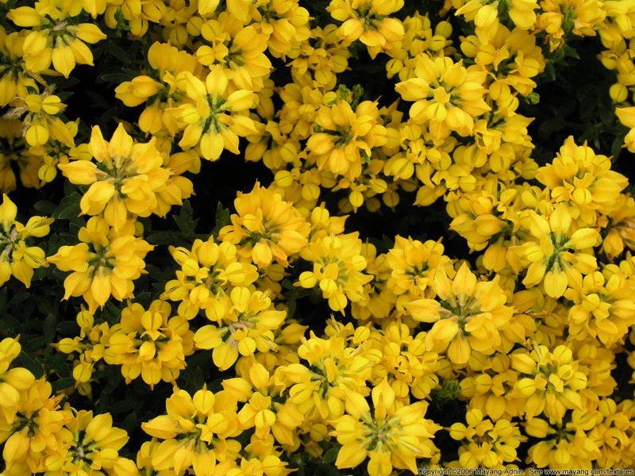

# SIFT-based-copy-move-forgery-detection
SIFT based copy move forgery detection and localisation

## Copy-move detection

Detect copy-move into an image:
~~~
im = cv2.imread("assets/fiori-gialli.jpg")
score = copy_move_detector(im)
~~~

## Copy-move localisation

Localize copy-move into an image:
~~~
image = cv2.imread('./assets/fiori-gialli.jpg')
    mask, score, _ = copy_move_localisation(image)
    bin_mask = 255 * (np.uint8(mask > 0))
~~~

`

## Parameter configuration

To tweak algorithm parameters edit the values in _configuration.py_.